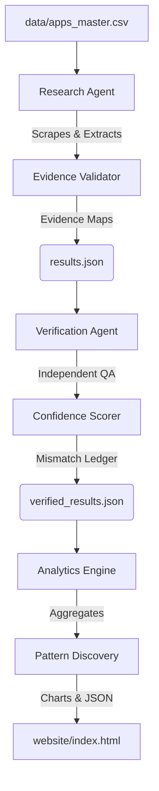

# Composio AI Product Intelligence Platform


## 📌 Project Overview
Composio turns apps into tools that AI agents can call. Building an integration requires meticulous research on authentication, API surfaces, developer access, and buildability across hundreds of applications.

This project is an **autonomous AI Product Intelligence Platform** built for the Composio AI Product Operations Internship assignment. It completely automates the research, verification, and analysis of 100 SaaS applications, reducing hours of manual discovery into a highly scalable, two-minute automated pipeline.

## 🏗 System Architecture
The platform is built on a dual-agent architecture with strict data validation and a decoupled analytics engine.



## 🚀 Workflow
The pipeline operates in 4 sequential phases:
1. **Phase 3 (Research)**: The `ResearchAgent` scrapes official developer docs and leverages OpenAI Structured Outputs to enforce Pydantic schemas. It maps every field to an exact evidence URL.
2. **Phase 4 (Verification)**: A zero-temperature `VerifierAgent` independently reads the context and re-verifies the data. Discrepancies generate a mismatch ledger and flag the app for manual human review.
3. **Phase 5 (Analytics)**: Pandas-driven engines calculate buildability distributions, rank integration priorities, and utilize LLMs to generate executive findings and visualizations.
4. **Phase 6 (Delivery)**: A blazing-fast Vanilla JS/CSS frontend renders the JSON outputs into a premium, interactive case study.

## 📂 Project Structure
```text
composio-research-platform/
├── config/              # Pydantic schemas and environment settings
├── data/                # Master datasets and JSON outputs
├── src/
│   ├── agents/          # LLM Research tools
│   ├── analytics/       # Pandas intelligence engines
│   ├── core/            # Pipeline orchestrator
│   ├── tools/           # Tavily search & BeautifulSoup scrapers
│   └── verification/    # Independent QA and difference detectors
├── tests/               # Pytest suite for schema enforcement
├── website/             # Vanilla HTML/CSS/JS final dashboard
├── run_research.py      # Executes Phase 3
├── run_verification.py  # Executes Phase 4
├── run_analytics.py     # Executes Phase 5
└── build_website.py     # Executes Phase 6 (Copies assets)
```

## 🔧 Installation & Usage

### Prerequisites
- Python 3.10+
- OpenAI API Key
- Tavily API Key (for web searching)

### Setup
```bash
# 1. Clone the repository
git clone https://github.com/yourusername/composio-research-platform.git
cd composio-research-platform

# 2. Setup Virtual Environment
python3 -m venv venv
source venv/bin/activate

# 3. Install Dependencies
pip install -r requirements.txt

# 4. Configure Environment
cp .env.example .env
# Edit .env and add your OPENAI_API_KEY and TAVILY_API_KEY
```

### Execution
The pipeline must be run sequentially:
```bash
# Step 1: Run Research
python run_research.py

# Step 2: Verify Data
python run_verification.py

# Step 3: Generate Analytics
python run_analytics.py

# Step 4: Build Website Assets
python build_website.py
```
Open `website/index.html` in your browser to view the final dashboard.

## 🛡 Verification Methodology
To prevent AI hallucinations, this platform relies on **Evidence Mapping** and **Independent Auditing**.
- **Evidence Mapping**: The LLM cannot simply return "OAuth2". It must return `{"value": "OAuth2", "evidence": {"url": "https://docs.stripe.com/api", "reason": "Explicitly stated in auth section"}}`.
- **Zero-Trust QA**: The Verification Agent operates at temperature `0.0`. It is instructed to disagree with the Research Agent if the scraped context does not mathematically support the claim. If confidence drops below 80%, the integration is dumped into a `manual_review_queue.json`.

## 🔮 Future Improvements
If given another sprint, the platform could be scaled by:
1. **Headless Browser Integration**: Using Playwright to render JS-heavy developer portals (like Stoplight) that BeautifulSoup cannot parse.
2. **Cron Job Rescanning**: Setting up GitHub Actions to re-run the Verification agent weekly to detect API deprecations.
3. **Automated PRs**: If an application transitions from "Hard" to "Ready Today", the Analytics engine could automatically trigger a Pull Request to Composio's monorepo scaffolding the integration.
